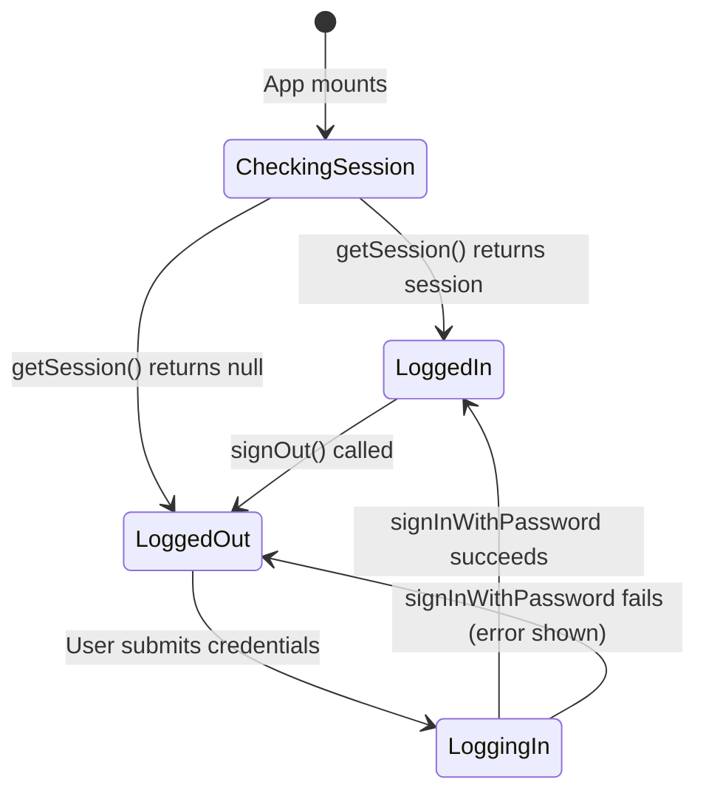

# Design Document — Supabase Backend Migration

## Overview

Samuel Milko's portfolio website currently runs as a Node.js monorepo: an Express server (`server.ts`) hosts both the REST API and Vite dev middleware, with all data persisted in a local JSON file (`data/portfolio-db.json`) managed by a `LocalJSONDatabase` class in `server/db.ts`. The frontend (`src/`) is a React + Vite SPA that talks to `/api/*` endpoints via a hand-rolled HTTP client (`src/lib/api.ts`).

This migration eliminates the entire server tier and replaces it with:

- **Supabase** — PostgreSQL database, Row Level Security, and Auth
- **Cloudinary** — CDN for images and PDF resume (only URLs stored in Supabase)
- **Pure Vite frontend** — no Node.js process; the browser talks directly to Supabase via `@supabase/supabase-js`

The result is a statically-hostable SPA with zero server maintenance burden. All admin capabilities are preserved; the auth mechanism changes from a custom session token stored in `sessionStorage` to Supabase Auth's built-in `localStorage`-backed session.

### Goals

1. Replace `src/lib/api.ts` with `src/lib/supabase.ts` — same surface area, typed against the new schema.
2. Replace Express auth (`/api/auth/login`) with `supabase.auth.signInWithPassword`.
3. Enforce data integrity and access control at the database level via RLS.
4. Preserve all 9 entity types and their CRUD semantics in the admin dashboard.
5. Migrate all existing seed data without data loss.

### Non-Goals

- Adding new portfolio entities beyond those already present.
- Server-side rendering or edge functions.
- Real-time subscriptions (Supabase Realtime is not used).

---

## Architecture

### Before (Current)

```
Browser
  └─ HTTP fetch → /api/*
                    └─ Express (server.ts, port 3000)
                         ├─ Auth: custom hash + sessionStorage token
                         ├─ CRUD: LocalJSONDatabase (server/db.ts)
                         └─ Data: data/portfolio-db.json (flat file)
```

### After (Target)

```
Browser
  ├─ @supabase/supabase-js ──► Supabase PostgreSQL (RLS enforced)
  │                              ├─ Public SELECT: all tables except messages
  │                              ├─ Anon INSERT: messages only
  │                              └─ Authenticated: full access all tables
  ├─ Supabase Auth ─────────► JWT session (localStorage, managed by client)
  └─ Cloudinary Widget ─────► Cloudinary CDN (secure_url only stored in DB)

Build / Dev
  └─ Vite (vite.config.ts) — no proxy, no Express dependency
```

### Key Architectural Decisions

| Decision | Rationale |
|---|---|
| Browser talks directly to Supabase | Eliminates the Express process entirely; Supabase's PostgREST layer replaces all CRUD endpoints |
| RLS instead of middleware auth checks | Access control is enforced at the database row level; no server code can accidentally bypass it |
| Cloudinary Upload Widget (unsigned preset) | File upload happens browser → Cloudinary directly; the backend never handles binary data |
| `Promise.allSettled` for DataContext fetches | One slow or failed entity does not block rendering of the rest of the page |
| Singleton `settings` row via CHECK constraint | Guarantees exactly one configuration row without application-level guards |
| Pinned `@supabase/supabase-js` version | Prevents silent breaking changes from minor Supabase client updates |

---

## Components and Interfaces

### Component Diagram

```
┌─────────────────────────────────────────────────────────────────────┐
│  Browser (React + Vite SPA)                                         │
│                                                                     │
│  ┌──────────────────┐   uses   ┌─────────────────────────────────┐  │
│  │  DataContext.tsx  │─────────►  src/lib/supabase.ts            │  │
│  │  (Provider)       │         │  ─ supabase (client instance)   │  │
│  └──────────────────┘         │  ─ getSettings()                 │  │
│         │                     │  ─ getCategories()               │  │
│         │ exposes              │  ─ getProjects()                 │  │
│         ▼                     │  ─ getProjectImages(projectId)   │  │
│  All public components        │  ─ getServices()                 │  │
│  (Hero, Capabilities,         │  ─ getSkills()                   │  │
│   FeaturedWork, etc.)         │  ─ getExperiences()              │  │
│                               │  ─ getSocialLinks()              │  │
│  ┌──────────────────┐         │  ─ getProcessSteps()             │  │
│  │ AdminDashboard   │─────────►  ─ getPhilosophyItems()          │  │
│  │  .tsx            │  uses   │  ─ updateSettings(data)          │  │
│  └──────────────────┘         │  ─ createProject(data)           │  │
│                               │  ─ updateProject(id, data)       │  │
│  ┌──────────────────┐         │  ─ deleteProject(id)             │  │
│  │  ContactForm.tsx │─────────►  ─ createMessage(data)           │  │
│  └──────────────────┘  uses   │  ─ [+ all other entity CRUDs]    │  │
│                               └─────────────────────────────────┘  │
│                                        │                            │
│  ┌──────────────────┐                  │ @supabase/supabase-js      │
│  │ CloudinaryWidget │                  ▼                            │
│  │ (window.cloudinary│         Supabase (external)                  │
│  │  .createUploadWidget)       ┌────────────────────┐              │
│  └──────────────────┘         │  PostgreSQL + RLS   │              │
│           │                   │  Supabase Auth      │              │
│           │ secure_url        └────────────────────┘              │
│           ▼                                                         │
│    Cloudinary CDN (external)                                        │
└─────────────────────────────────────────────────────────────────────┘
```

### `src/lib/supabase.ts` — Full Function Signatures

```typescript
import { createClient, SupabaseClient } from '@supabase/supabase-js';
import type {
  Settings, Category, Project, ProjectImage, Service,
  Skill, Experience, Message, SocialLink, ProcessStep, PhilosophyItem
} from '../types';

// Exported client instance
export const supabase: SupabaseClient;

// ── Settings ──────────────────────────────────────────────────────────
export async function getSettings(): Promise<Settings>;
export async function updateSettings(data: Partial<Settings>): Promise<Settings>;

// ── Categories ────────────────────────────────────────────────────────
export async function getCategories(): Promise<Category[]>;
export async function createCategory(data: Omit<Category, 'id'>): Promise<Category>;
export async function updateCategory(id: string, data: Partial<Category>): Promise<Category>;
export async function deleteCategory(id: string): Promise<void>;

// ── Projects ──────────────────────────────────────────────────────────
export async function getProjects(): Promise<Project[]>;
export async function createProject(data: Omit<Project, 'id'>): Promise<Project>;
export async function updateProject(id: string, data: Partial<Project>): Promise<Project>;
export async function deleteProject(id: string): Promise<void>;

// ── Project Images ────────────────────────────────────────────────────
export async function getProjectImages(projectId: string): Promise<ProjectImage[]>;
export async function createProjectImage(data: Omit<ProjectImage, 'id'>): Promise<ProjectImage>;
export async function updateProjectImage(id: string, data: Partial<ProjectImage>): Promise<ProjectImage>;
export async function deleteProjectImage(id: string): Promise<void>;

// ── Services ──────────────────────────────────────────────────────────
export async function getServices(): Promise<Service[]>;
export async function createService(data: Omit<Service, 'id'>): Promise<Service>;
export async function updateService(id: string, data: Partial<Service>): Promise<Service>;
export async function deleteService(id: string): Promise<void>;

// ── Skills ────────────────────────────────────────────────────────────
export async function getSkills(): Promise<Skill[]>;
export async function createSkill(data: Omit<Skill, 'id'>): Promise<Skill>;
export async function updateSkill(id: string, data: Partial<Skill>): Promise<Skill>;
export async function deleteSkill(id: string): Promise<void>;

// ── Experiences ───────────────────────────────────────────────────────
export async function getExperiences(): Promise<Experience[]>;
export async function createExperience(data: Omit<Experience, 'id'>): Promise<Experience>;
export async function updateExperience(id: string, data: Partial<Experience>): Promise<Experience>;
export async function deleteExperience(id: string): Promise<void>;

// ── Messages ──────────────────────────────────────────────────────────
export async function getMessages(): Promise<Message[]>;       // admin only
export async function createMessage(data: Pick<Message, 'name' | 'email' | 'subject' | 'message'>): Promise<Message>;
export async function updateMessage(id: string, data: Partial<Message>): Promise<Message>;
export async function deleteMessage(id: string): Promise<void>;

// ── Social Links ──────────────────────────────────────────────────────
export async function getSocialLinks(): Promise<SocialLink[]>;
export async function createSocialLink(data: Omit<SocialLink, 'id'>): Promise<SocialLink>;
export async function updateSocialLink(id: string, data: Partial<SocialLink>): Promise<SocialLink>;
export async function deleteSocialLink(id: string): Promise<void>;

// ── Process Steps ─────────────────────────────────────────────────────
export async function getProcessSteps(): Promise<ProcessStep[]>;
export async function createProcessStep(data: Omit<ProcessStep, 'id'>): Promise<ProcessStep>;
export async function updateProcessStep(id: string, data: Partial<ProcessStep>): Promise<ProcessStep>;
export async function deleteProcessStep(id: string): Promise<void>;

// ── Philosophy Items ──────────────────────────────────────────────────
export async function getPhilosophyItems(): Promise<PhilosophyItem[]>;
export async function createPhilosophyItem(data: Omit<PhilosophyItem, 'id'>): Promise<PhilosophyItem>;
export async function updatePhilosophyItem(id: string, data: Partial<PhilosophyItem>): Promise<PhilosophyItem>;
export async function deletePhilosophyItem(id: string): Promise<void>;
```

**Initialization guard** — the module throws before creating the client if any required env var is missing:

```typescript
const REQUIRED_VARS = [
  'VITE_SUPABASE_URL',
  'VITE_SUPABASE_ANON_KEY',
  'VITE_CLOUDINARY_CLOUD_NAME',
  'VITE_CLOUDINARY_UPLOAD_PRESET',
] as const;

for (const key of REQUIRED_VARS) {
  if (!import.meta.env[key]) {
    throw new Error(`Missing required environment variable: ${key}`);
  }
}
```

---

## Data Models

### Database Schema (ERD)

```
settings (singleton)
  id          uuid PK  CHECK(id = '00000000-0000-0000-0000-000000000001')
  website_title   text
  logo            text
  theme_color     text
  footer_text     text
  biography       text
  hero_text       text
  profile_picture_url  text
  resume_url      text
  years_experience     text
  projects_completed   text
  happy_clients        text

categories
  id    uuid PK  gen_random_uuid()
  name  text NOT NULL
  slug  text UNIQUE NOT NULL

projects
  id                uuid PK
  title             text NOT NULL
  slug              text UNIQUE NOT NULL
  client            text
  project_date      text
  description       text
  technologies      text[]
  cover_image_url   text
  banner_image_url  text
  video_url         text
  creative_process  text
  challenges        text
  final_result      text
  is_featured       boolean DEFAULT false
  featured_order    integer
  category_id       uuid FK → categories.id
  testimonial_quote   text
  testimonial_author  text
  testimonial_role    text

project_images
  id            uuid PK
  project_id    uuid FK → projects.id ON DELETE CASCADE
  image_url     text NOT NULL
  caption       text
  display_order integer

services
  id            uuid PK
  name          text NOT NULL
  description   text
  icon          text
  display_order integer

skills
  id            uuid PK
  name          text NOT NULL
  percentage    integer CHECK(percentage >= 0 AND percentage <= 100)
  icon          text
  display_order integer

experiences
  id            uuid PK
  company       text
  position      text
  description   text
  start_date    text
  end_date      text
  display_order integer

messages
  id          uuid PK
  name        text NOT NULL
  email       text NOT NULL
  subject     text
  message     text NOT NULL
  created_at  timestamptz DEFAULT now()
  is_read     boolean DEFAULT false

social_links
  id        uuid PK
  platform  text NOT NULL
  url       text NOT NULL

process_steps
  id            uuid PK
  number        text
  title         text NOT NULL
  description   text
  display_order integer

philosophy_items
  id            uuid PK
  title         text NOT NULL
  description   text
  display_order integer
```

### Field Name Mapping (JSON → SQL)

| `portfolio-db.json` field | Supabase column |
|---|---|
| `projectDate` | `project_date` |
| `coverImage` | `cover_image_url` |
| `bannerImage` | `banner_image_url` |
| `videoUrl` | `video_url` |
| `creativeProcess` | `creative_process` |
| `finalResult` | `final_result` |
| `isFeatured` | `is_featured` |
| `featuredOrder` | `featured_order` |
| `categoryId` | `category_id` |
| `profilePicture` | `profile_picture_url` |
| `resumeUrl` | `resume_url` |
| `yearsExperience` | `years_experience` |
| `projectsCompleted` | `projects_completed` |
| `happyClients` | `happy_clients` |
| `startDate` | `start_date` |
| `endDate` | `end_date` |
| `iconName` / `icon` | `icon` |
| `order` | `display_order` |
| `websiteTitle` | `website_title` |

### TypeScript Interfaces (`src/types.ts`)

All interfaces use snake_case to match the column names exactly:

```typescript
export interface Settings {
  id: string;
  website_title: string;
  logo: string;
  theme_color: string;
  footer_text: string;
  biography: string;
  hero_text: string;
  profile_picture_url: string | null;
  resume_url: string | null;
  years_experience: string;
  projects_completed: string;
  happy_clients: string;
}

export interface Project {
  id: string;
  title: string;
  slug: string;
  client: string | null;
  project_date: string | null;
  description: string | null;
  technologies: string[];
  cover_image_url: string | null;
  banner_image_url: string | null;
  video_url: string | null;
  creative_process: string | null;
  challenges: string | null;
  final_result: string | null;
  is_featured: boolean;
  featured_order: number | null;
  category_id: string | null;
  testimonial_quote: string | null;
  testimonial_author: string | null;
  testimonial_role: string | null;
}

// ... (Category, ProjectImage, Service, Skill, Experience,
//      Message, SocialLink, ProcessStep, PhilosophyItem
//      — see requirements.md §5 for complete definitions)
```

---

## Data Flow

### Public Page Load

```
1. Browser imports src/lib/supabase.ts
   └─ Module guard checks 4 env vars → throws if any missing

2. DataContext.fetchData() called on mount
   └─ Promise.allSettled([
        getSettings(), getCategories(), getProjects(),
        getProjectImages(), getServices(), getSkills(),
        getExperiences(), getSocialLinks(), getProcessSteps(),
        getPhilosophyItems()
      ])
   ├─ Each resolved → set entity state
   └─ Each rejected → set per-entity error string
      "Failed to load [entity]: [supabase error message]"

3. React components read from DataContext and render
   └─ Loading spinner shown while loading === true
```

### Admin Login Flow

```
1. AdminDashboard mounts
   └─ supabase.auth.getSession()
      ├─ session exists → render management UI directly
      └─ no session → render login form

2. User submits login form
   └─ supabase.auth.signInWithPassword({ email, password })
      ├─ success → Supabase client stores JWT in localStorage (sb-* keys)
      │            AdminDashboard transitions to management UI
      └─ error   → display error.message inline on form

3. User clicks logout
   └─ supabase.auth.signOut()
      └─ AdminDashboard transitions back to login form
```

### Admin Write Flow (e.g., update project)

```
1. Admin edits form fields
2. Submits form → updateProject(id, payload) called
   └─ supabase.from('projects').update(payload).eq('id', id)
      ├─ success → refetch DataContext, show toast
      └─ error   → display inline "Failed to update project: [message]"
                   form values remain intact
```

### Contact Form Submission

```
1. Visitor fills form
2. Client-side validation runs (name, email, subject, message rules)
   ├─ fails → per-field inline error, no Supabase call
   └─ passes → disable submit + all fields

3. createMessage({ name, email, subject, message }) called
   └─ supabase.from('messages').insert(...)
      ├─ success → show "Message sent successfully", clear fields
      └─ error   → re-enable fields, preserve values, show error
```

### Cloudinary Upload Flow

```
1. Admin clicks upload button (e.g., "Upload Cover Image")
2. window.cloudinary.createUploadWidget(config, callback).open()
   config = {
     cloudName: VITE_CLOUDINARY_CLOUD_NAME,
     uploadPreset: VITE_CLOUDINARY_UPLOAD_PRESET,
     sources: ['local', 'url', 'camera'],
     resourceType: 'image' | 'raw',   // 'raw' for PDF
   }

3. Callback fires with (error, result)
   ├─ result.event === 'success'
   │   └─ setField(result.info.secure_url)   // write only secure_url
   ├─ error → display inline error, widget closes, field unchanged
   └─ user cancels → widget closes, field unchanged
```

---

## Row Level Security Design

RLS policies are defined in the same migration file as the schema (`supabase/migrations/20240101000000_initial_schema.sql`).

### Policy Matrix

| Table | anon SELECT | anon INSERT | anon UPDATE/DELETE | authenticated (any) |
|---|---|---|---|---|
| settings | ✅ | ❌ | ❌ | ✅ |
| categories | ✅ | ❌ | ❌ | ✅ |
| projects | ✅ | ❌ | ❌ | ✅ |
| project_images | ✅ | ❌ | ❌ | ✅ |
| services | ✅ | ❌ | ❌ | ✅ |
| skills | ✅ | ❌ | ❌ | ✅ |
| experiences | ✅ | ❌ | ❌ | ✅ |
| social_links | ✅ | ❌ | ❌ | ✅ |
| process_steps | ✅ | ❌ | ❌ | ✅ |
| philosophy_items | ✅ | ❌ | ❌ | ✅ |
| messages | ❌ | ✅ | ❌ | ✅ |

### Policy SQL Pattern

```sql
-- Enable RLS
ALTER TABLE projects ENABLE ROW LEVEL SECURITY;

-- Public read
CREATE POLICY "public_select_projects"
  ON projects FOR SELECT
  TO anon
  USING (true);

-- Admin full access
CREATE POLICY "admin_all_projects"
  ON projects FOR ALL
  TO authenticated
  USING (true)
  WITH CHECK (true);
```

For `messages`, the visitor INSERT policy is:

```sql
CREATE POLICY "anon_insert_messages"
  ON messages FOR INSERT
  TO anon
  WITH CHECK (true);
```

No SELECT/UPDATE/DELETE policy is created for the anon role on `messages`, so those operations are implicitly denied.

---

## Migration and Deletion Order

To avoid foreign key violations and ensure reversibility, changes are applied in this sequence:

```
Phase 1 — Database (Supabase dashboard / CLI)
  1. Apply supabase/migrations/20240101000000_initial_schema.sql
     └─ Creates all tables, constraints, indexes, RLS policies
  2. Apply supabase/seed.sql
     └─ Inserts all records from portfolio-db.json

Phase 2 — Frontend data layer
  3. Create src/lib/supabase.ts
  4. Update src/types.ts  (camelCase → snake_case interfaces)
  5. Update src/context/DataContext.tsx  (api.* → supabase.ts functions)

Phase 3 — Auth migration
  6. Create Supabase Auth user via Supabase dashboard
     (milkosamuel470@gmail.com — real password, not the demo hash)
  7. Update src/components/AdminDashboard.tsx
     └─ Replace api.login / sessionStorage token with supabase.auth.*

Phase 4 — Contact form
  8. Update src/components/ContactForm.tsx
     └─ Replace setTimeout mock with supabase createMessage() + validation

Phase 5 — Build system
  9. Update package.json  (remove express/tsx/esbuild, add @supabase/supabase-js)
  10. Verify vite.config.ts (no proxy block needed — already absent)
  11. Update .env.example

Phase 6 — Deletions (after verifying Phase 1–5 work correctly)
  12. Delete src/lib/api.ts
  13. Delete server.ts
  14. Delete server/db.ts  (remove server/ dir if empty)
  15. Delete data/portfolio-db.json  (remove data/ dir if empty)
```

This order ensures that at every phase there is a working, deployable state.

---

## Auth Flow Detail

### Session Lifecycle



### What Changes vs. Current Implementation

| Aspect | Before | After |
|---|---|---|
| Credentials check | `hashPassword` in `server/db.ts` against JSON users array | Supabase Auth (bcrypt, managed service) |
| Session storage | Custom token in `sessionStorage` under `admin_token` key | Supabase JWT in `localStorage` under `sb-*` keys (managed by client) |
| Auth check on load | `sessionStorage.getItem('admin_token')` | `supabase.auth.getSession()` |
| Logout | `sessionStorage.removeItem('admin_token')` | `supabase.auth.signOut()` |
| No custom token written | — | ✅ Requirement 3.3 |

The `AdminDashboard` component no longer needs `authToken` state or any `sessionStorage` calls. The Supabase client transparently refreshes the JWT before expiry.

---

## Cloudinary Integration Pattern

### Widget Initialization

The Cloudinary Upload Widget script is loaded once via a `<script>` tag in `index.html` or lazily on first use. It exposes `window.cloudinary` globally.

```typescript
// Utility wrapper (used inside AdminDashboard)
function openCloudinaryUpload(
  options: { resourceType: 'image' | 'raw'; acceptedFormats?: string[] },
  onSuccess: (secureUrl: string) => void,
  onError: (message: string) => void
) {
  const widget = window.cloudinary.createUploadWidget(
    {
      cloudName: import.meta.env.VITE_CLOUDINARY_CLOUD_NAME,
      uploadPreset: import.meta.env.VITE_CLOUDINARY_UPLOAD_PRESET,
      resourceType: options.resourceType,
      clientAllowedFormats: options.acceptedFormats,
      multiple: false,
    },
    (error: any, result: any) => {
      if (error) {
        onError(error.message ?? 'Upload failed');
        widget.close();
        return;
      }
      if (result?.event === 'success') {
        onSuccess(result.info.secure_url);
        widget.close();
      }
    }
  );
  widget.open();
}
```

### Upload Triggers per Field

| Form field | `resourceType` | `clientAllowedFormats` |
|---|---|---|
| `cover_image_url` | `image` | `jpg, png, gif, webp, svg` |
| `banner_image_url` | `image` | `jpg, png, gif, webp, svg` |
| `project_images.image_url` | `image` | `jpg, png, gif, webp, svg` |
| `profile_picture_url` | `image` | `jpg, png, gif, webp, svg` |
| `resume_url` | `raw` | `pdf` |

`video_url` is **not** a Cloudinary field — it accepts a plain YouTube URL typed directly into a text input.

### What is Stored

Only the `secure_url` string (e.g., `https://res.cloudinary.com/...`) is stored in Supabase. No binary data is written to Supabase Storage.

---

## Correctness Properties

*A property is a characteristic or behavior that should hold true across all valid executions of a system — essentially, a formal statement about what the system should do. Properties serve as the bridge between human-readable specifications and machine-verifiable correctness guarantees.*

### Property 1: Missing env var causes named initialization error

*For any* subset of the four required environment variables (`VITE_SUPABASE_URL`, `VITE_SUPABASE_ANON_KEY`, `VITE_CLOUDINARY_CLOUD_NAME`, `VITE_CLOUDINARY_UPLOAD_PRESET`) that contains at least one absent or empty value, importing `src/lib/supabase.ts` SHALL throw an `Error` whose message contains the exact name of the missing variable, before any network request is made.

**Validates: Requirements 1.1, 9.4**

---

### Property 2: Anon write operations on protected tables are always rejected

*For any* table in `{settings, categories, projects, project_images, services, skills, experiences, social_links, process_steps, philosophy_items}` and any write operation in `{INSERT, UPDATE, DELETE}` issued with the anon role, the Supabase RLS engine SHALL reject the operation with a policy violation error.

**Validates: Requirements 2.3**

---

### Property 3: DataContext partial failure leaves successful entities intact

*For any* non-empty subset of the ten DataContext data sources that fails (returns a Supabase error), the DataContext SHALL: (a) set an error string for each failing entity in the format `"Failed to load [entity]: [message]"`, and (b) correctly populate the state for every entity in the complementary (non-failing) subset, leaving those states unchanged from their fetched values.

**Validates: Requirements 4.2, 4.3**

---

### Property 4: No custom token is written to browser storage after login

*For any* successful `supabase.auth.signInWithPassword` call, the set of keys present in `localStorage` and `sessionStorage` after login SHALL NOT contain any key that does not match the Supabase client's own key prefix pattern (`sb-*`). Specifically, the key `admin_token` SHALL NOT be present.

**Validates: Requirements 3.3**

---

### Property 5: Cloudinary secure_url is stored verbatim

*For any* Cloudinary upload result object where `result.event === 'success'`, the value written to the corresponding form field SHALL be exactly `result.info.secure_url` — no transformation, truncation, or re-encoding applied.

**Validates: Requirements 7.3**

---

### Property 6: Contact form validation rejects exactly the invalid inputs

*For any* tuple `(name, email, subject, message)`, the contact form's client-side validator SHALL accept the input if and only if all four conditions hold simultaneously:
- `name.trim().length >= 1 && name.length <= 100`
- `email` contains `@` and at least one `.` after the `@`
- `subject.trim().length >= 1 && subject.length <= 200`
- `message.trim().length >= 1 && message.length <= 5000`

When any condition fails, no Supabase INSERT SHALL be invoked.

**Validates: Requirements 8.1**

---

### Property 7: Contact form error preserves all field values

*For any* valid form submission that receives a Supabase error response, every form field's value after the error SHALL equal its value at the time of submission — no field is cleared or modified by the error handler.

**Validates: Requirements 8.4**

---

### Property 8: Seed SQL is idempotent

*For any* freshly migrated Supabase database, executing `supabase/seed.sql` exactly twice SHALL produce the same row counts as executing it once — no duplicate rows, no errors on second execution.

**Validates: Requirements 11.5**

---

### Property Reflection

After reviewing the eight properties above:

- Properties 1 and an earlier formulation of "9.4" are identical — merged into Property 1.
- Properties 3 and an earlier "per-entity error string" property (4.3) are unified in Property 3, since partial failure directly implies both the error format and the unchanged-state guarantee.
- The RLS SELECT-on-public-tables property (Requirement 2.2) is classified as INTEGRATION, not PBT — SELECT behavior doesn't vary meaningfully with generated inputs, and the Supabase RLS engine is an external service being verified, not our own code logic.
- Properties 6 and 7 together cover the full contact form correctness surface; they are not redundant because Property 6 tests the validation gate and Property 7 tests the error recovery path.
- Property 8 tests a pure semantic of SQL `ON CONFLICT DO NOTHING` as applied to our specific seed data; 100 iterations are justified because different seeding orders or partial states could expose issues.

No properties were eliminated as fully redundant; each validates a distinct behavioral guarantee.

---

## Error Handling

### Initialization Errors

| Condition | Behaviour |
|---|---|
| Missing env var on module import | `throw new Error('Missing required environment variable: VAR_NAME')` before client creation |
| Supabase project unreachable on first query | DataContext catches the rejection, sets per-entity error string, renders partial UI |

### Data Fetch Errors

`DataContext` uses `Promise.allSettled`, so a single failing query never crashes the page. Each rejected promise produces an error string stored in component state:

```
"Failed to load projects: JWT expired"
"Failed to load settings: relation "settings" does not exist"
```

Public components receive `null` / `[]` defaults and can render gracefully without the failing data.

### Write Errors (Admin)

Every write function (`createProject`, `updateSettings`, etc.) propagates the Supabase `error` object to the caller. `AdminDashboard` catches it and displays:

```
"Failed to update project: new row violates row-level security policy"
```

Form field values are kept in local state, so the admin can correct and resubmit.

### Auth Errors

`supabase.auth.signInWithPassword` returns `{ data, error }`. When `error` is non-null, its `message` is displayed inline on the login form. The component never navigates or clears credentials.

### Cloudinary Errors

The widget callback receives `(error, result)`. When `error` is truthy, an inline error message is shown adjacent to the upload button. The widget is closed. The URL field retains its previous value.

### Contact Form Errors

Two error surfaces:
1. **Validation errors** — displayed per-field before any network call.
2. **Supabase INSERT errors** — displayed as a single inline message; all fields re-enabled with values intact.

---

## Testing Strategy

### Approach

This feature is a data-layer migration with well-defined input/output contracts, making it a good candidate for a **dual testing strategy**:

- **Unit / property tests** for pure logic: env var guard, form validation, Cloudinary callback handler, DataContext error accumulation.
- **Integration tests** for RLS policies, auth flows, and seed idempotency — these require a real (or locally emulated) Supabase instance.

### Property-Based Testing Library

**[fast-check](https://github.com/dubzzz/fast-check)** (TypeScript, pinned exact version) is used for all property-based tests. It integrates with Vitest via `fc.assert(fc.property(...))`.

Each property test runs a **minimum of 100 iterations** (fast-check default is 100; set `numRuns: 100` explicitly).

### Property Tests

Each test is tagged with a reference comment matching the design property.

```typescript
// Feature: supabase-backend-migration, Property 1: Missing env var causes named initialization error
it('throws for each missing env var', () => {
  fc.assert(fc.property(
    fc.subarray(REQUIRED_VARS, { minLength: 1 }),
    (missingVars) => {
      const env = buildEnvWithout(missingVars);
      expect(() => initSupabaseClient(env)).toThrow(missingVars[0]);
    }
  ), { numRuns: 100 });
});
```

```typescript
// Feature: supabase-backend-migration, Property 3: DataContext partial failure leaves successful entities intact
it('populates non-failing entities when some queries fail', async () => {
  fc.assert(fc.asyncProperty(
    fc.subarray(ALL_ENTITIES, { minLength: 1, maxLength: 9 }),
    async (failingEntities) => {
      const mockSupabase = buildMockWithFailures(failingEntities);
      const result = await fetchAllWithMock(mockSupabase);
      for (const entity of failingEntities) {
        expect(result.errors[entity]).toMatch(/^Failed to load/);
      }
      for (const entity of ALL_ENTITIES.filter(e => !failingEntities.includes(e))) {
        expect(result.data[entity]).toBeDefined();
      }
    }
  ), { numRuns: 100 });
});
```

```typescript
// Feature: supabase-backend-migration, Property 6: Contact form validation
it('accepts valid and rejects invalid input tuples', () => {
  fc.assert(fc.property(
    fc.record({
      name: fc.string({ minLength: 0, maxLength: 110 }),
      email: fc.oneof(fc.emailAddress(), fc.string()),
      subject: fc.string({ minLength: 0, maxLength: 210 }),
      message: fc.string({ minLength: 0, maxLength: 5100 }),
    }),
    ({ name, email, subject, message }) => {
      const valid = validateContactForm({ name, email, subject, message });
      const expected =
        name.trim().length >= 1 && name.length <= 100 &&
        email.includes('@') && email.indexOf('.', email.indexOf('@')) > email.indexOf('@') &&
        subject.trim().length >= 1 && subject.length <= 200 &&
        message.trim().length >= 1 && message.length <= 5000;
      expect(valid.isValid).toBe(expected);
    }
  ), { numRuns: 100 });
});
```

### Unit / Example Tests

| Test | Type | Description |
|---|---|---|
| Supabase Auth login success | EXAMPLE | Mock `signInWithPassword` success, verify dashboard shown |
| Supabase Auth login failure | EXAMPLE | Mock error, verify inline message shown, no navigation |
| Logout | EXAMPLE | Verify `signOut` called, login form rendered |
| Session restore on mount | EXAMPLE | Mock `getSession` with session, verify dashboard shown |
| Cloudinary cancel | EXAMPLE | Widget closed, field unchanged |
| Contact INSERT success | EXAMPLE | Success message shown, fields cleared |
| RLS anon INSERT on messages | EXAMPLE | Anon client insert on messages succeeds |
| RLS anon SELECT on messages | EXAMPLE | Anon client select on messages returns error |

### Integration Tests (Supabase local or staging)

| Test | Description |
|---|---|
| Schema smoke | All 11 tables exist with correct column types |
| RLS visitor reads | Anon SELECT on each public table returns rows |
| RLS visitor writes blocked | Anon write on protected tables returns policy error |
| Seed idempotency | Run seed.sql twice; row counts equal after both runs |
| Authenticated full access | Authenticated write on any table succeeds |

### Build Verification

```bash
# No service_role in bundle
vite build && grep -r "service_role" dist/ # must return 0 matches

# TypeScript types
tsc --noEmit

# Import check: no old api.ts references
grep -r "from.*lib/api" src/ # must return 0 matches
```
